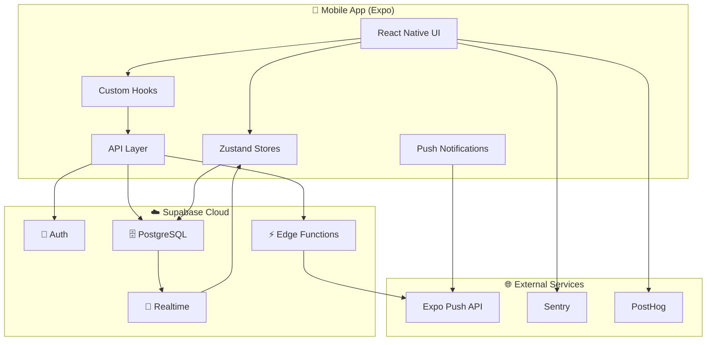
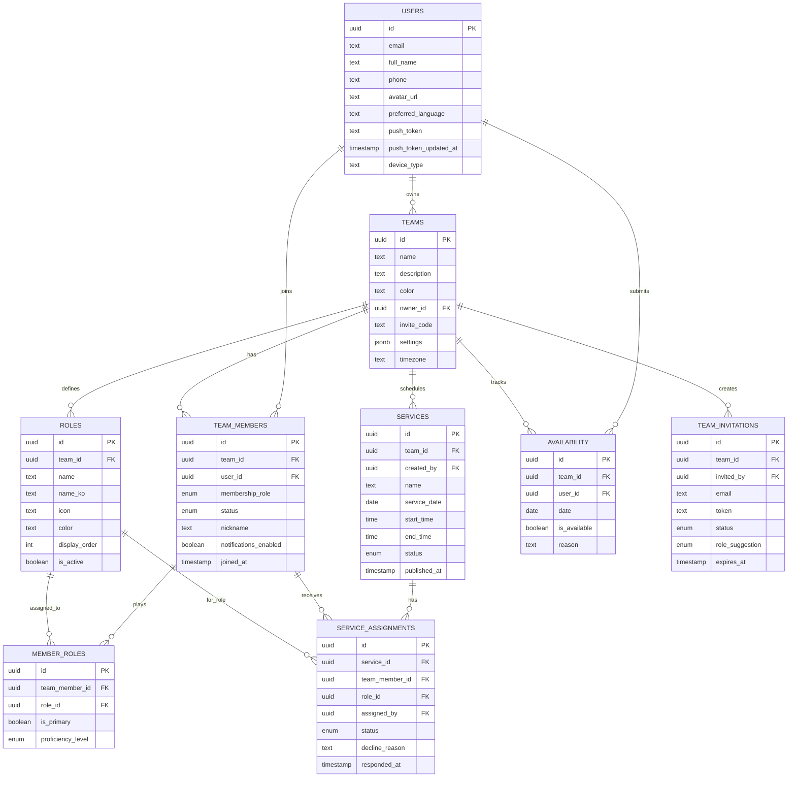
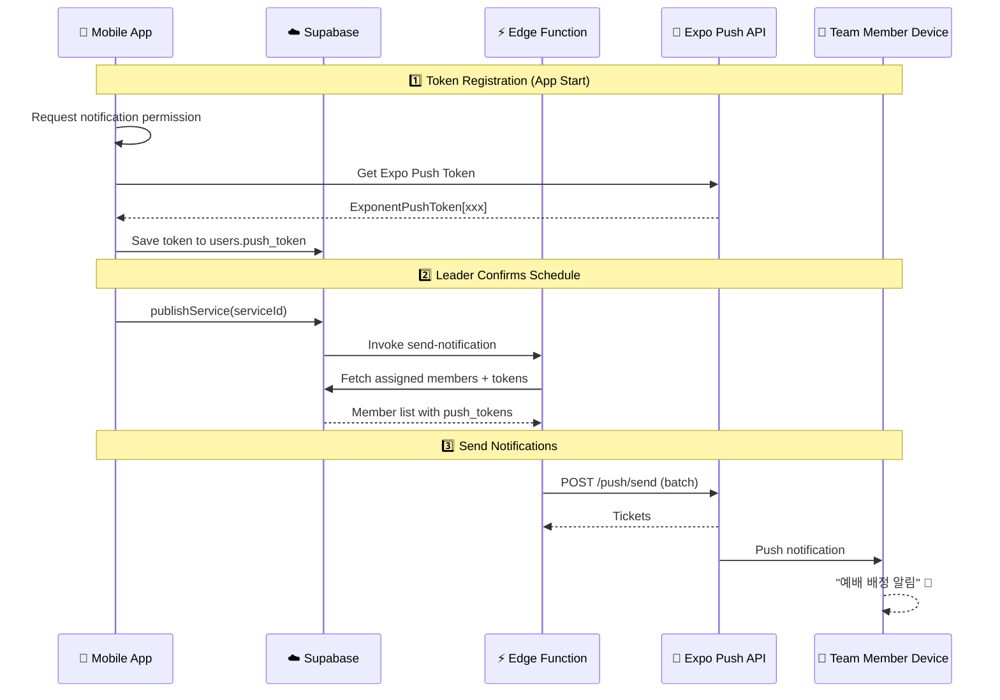
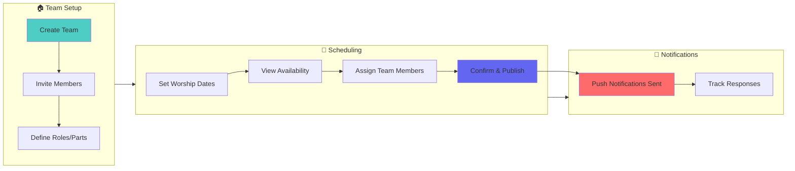
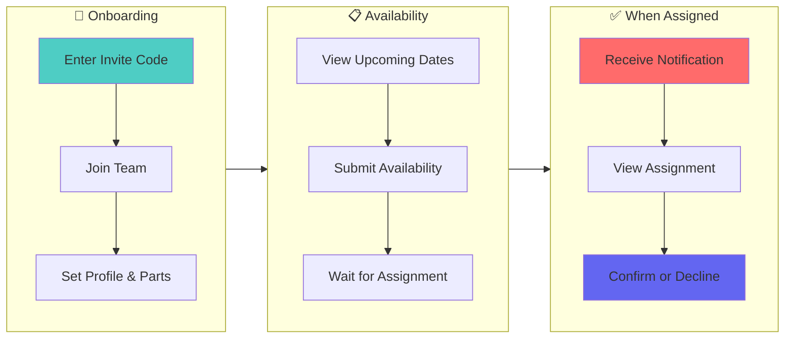
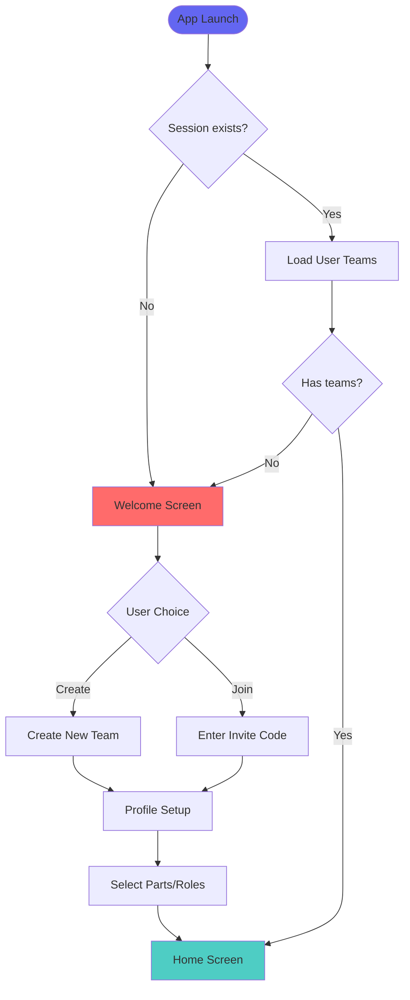
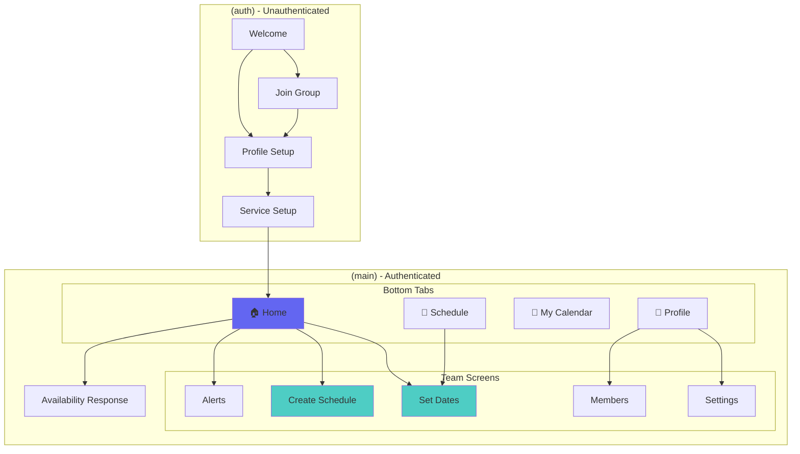

# Worship Team Scheduler (찬양팀 스케줄러)

A mobile app for worship team scheduling, built with React Native (Expo) and Supabase.

## Tech Stack

| Layer | Technology |
|-------|------------|
| **Frontend** | React Native, Expo SDK 54, TypeScript |
| **State Management** | Zustand |
| **Backend** | Supabase (PostgreSQL, Auth, Edge Functions) |
| **Push Notifications** | Expo Push Notifications |
| **Analytics** | PostHog, Sentry |
| **Styling** | NativeWind (TailwindCSS) |

---

## Architecture Overview



---

## Database Schema (ERD)



---

## Push Notification Flow



---

## User Flows

### Leader Flow (Owner/Admin)



### Member Flow



---

## Authentication Flow



---

## App Screen Navigation



---

## Key Features

### For Leaders (Owners/Admins)
- ✅ Create and manage worship teams
- ✅ Set worship dates (regular + ad-hoc services)
- ✅ View team member availability at a glance
- ✅ Assign team members to services based on availability
- ✅ Send push notifications when schedule is confirmed
- ✅ Manage team members (promote/demote/remove)

### For Members
- ✅ Join teams via invite code
- ✅ Submit availability for upcoming dates
- ✅ Receive push notifications when assigned
- ✅ View personal calendar with assignments
- ✅ Confirm or decline assignments

---

## Project Structure

```
src/
├── app/                    # Expo Router screens
│   ├── (auth)/            # Authentication flow
│   ├── (main)/            # Main app screens
│   │   ├── (tabs)/        # Bottom tab screens
│   │   └── team/          # Team-specific screens
│   └── _layout.tsx        # Root layout
├── components/            # Reusable UI components
├── hooks/                 # Custom React hooks
├── lib/                   # Core utilities
│   ├── api/              # API functions (CRUD)
│   ├── supabase.ts       # Supabase client
│   ├── notifications.ts  # Push notification logic
│   └── theme.ts          # Design tokens
├── providers/            # Context providers
├── store/                # Zustand stores
└── types/                # TypeScript types

supabase/
├── functions/            # Edge Functions
│   └── send-notification/
└── migrations/           # Database migrations
```

---

## Environment Variables

```env
# Supabase
EXPO_PUBLIC_SUPABASE_URL=https://xxx.supabase.co
EXPO_PUBLIC_SUPABASE_ANON_KEY=eyJxxx

# Analytics
EXPO_PUBLIC_SENTRY_DSN=https://xxx@sentry.io/xxx
EXPO_PUBLIC_POSTHOG_API_KEY=phc_xxx
EXPO_PUBLIC_POSTHOG_HOST=https://us.i.posthog.com

# Expo
EXPO_TOKEN=xxx
```

---

## Getting Started

```bash
# Install dependencies
pnpm install

# Start development server
pnpm start

# Run on iOS
pnpm ios

# Run on Android
pnpm android
```

---

## Deployment

### Database Migration
```bash
supabase db push
```

### Edge Functions
```bash
supabase functions deploy send-notification
```

### App Build
```bash
eas build --platform all
```

---

## Diagrams

Interactive Excalidraw diagrams are available in the `docs/` folder:

- [`docs/architecture.excalidraw`](docs/architecture.excalidraw) - System architecture & push notification flow
- [`docs/database-erd.excalidraw`](docs/database-erd.excalidraw) - Database entity relationship diagram

Open these files at [excalidraw.com](https://excalidraw.com) or use the VS Code Excalidraw extension.

---

## License

MIT
