# Worship Team Scheduler (찬양팀 스케줄러)

A mobile app for worship team scheduling, built with React Native (Expo) and Supabase.

## Tech Stack

| Layer | Technology |
|-------|------------|
| **Frontend** | React Native, Expo SDK 54, TypeScript |
| **State Management** | Zustand |
| **Backend** | Supabase (PostgreSQL, Auth, Edge Functions) |
| **Push Notifications** | Expo Push Notifications |
| **Analytics** | PostHog, Sentry |
| **Styling** | NativeWind (TailwindCSS) |

---

## Architecture Overview

```mermaid
flowchart TB
    subgraph Client["📱 Mobile App (Expo)"]
        UI["React Native UI"]
        Store["Zustand Stores"]
        Hooks["Custom Hooks"]
        API["API Layer"]
        Notif["Push Notifications"]
    end

    subgraph Supabase["☁️ Supabase Cloud"]
        Auth["🔐 Auth"]
        DB["🗄️ PostgreSQL"]
        Edge["⚡ Edge Functions"]
        RT["🔄 Realtime"]
    end

    subgraph External["🌐 External Services"]
        ExpoPush["Expo Push API"]
        Sentry["Sentry"]
        PostHog["PostHog"]
    end

    UI --> Store
    UI --> Hooks
    Hooks --> API
    API --> Auth
    API --> DB
    API --> Edge
    Store --> DB
    Notif --> ExpoPush
    Edge --> ExpoPush
    UI --> Sentry
    UI --> PostHog
    DB --> RT
    RT --> Store
```



---

## Database Schema (ERD)


---

## Push Notification Flow

```mermaid
sequenceDiagram
    participant App as 📱 Mobile App
    participant Supabase as ☁️ Supabase
    participant Edge as ⚡ Edge Function
    participant Expo as 🔔 Expo Push API
    participant Device as 📲 Team Member Device

    Note over App,Device: 1️⃣ Token Registration (App Start)
    App->>App: Request notification permission
    App->>Expo: Get Expo Push Token
    Expo-->>App: ExponentPushToken[xxx]
    App->>Supabase: Save token to users.push_token

    Note over App,Device: 2️⃣ Leader Confirms Schedule
    App->>Supabase: publishService(serviceId)
    Supabase->>Edge: Invoke send-notification
    Edge->>Supabase: Fetch assigned members + tokens
    Supabase-->>Edge: Member list with push_tokens

    Note over App,Device: 3️⃣ Send Notifications
    Edge->>Expo: POST /push/send (batch)
    Expo-->>Edge: Tickets
    Expo->>Device: Push notification
    Device-->>Device: "예배 배정 알림" 🔔
```



---

## User Flows

### Leader Flow (Owner/Admin)


### Member Flow


---

## Authentication Flow


---

## App Screen Navigation

```mermaid
flowchart TB
    subgraph Auth["(auth) - Unauthenticated"]
        welcome[Welcome]
        joinGroup[Join Group]
        profileSetup[Profile Setup]
        serviceSetup[Service Setup]
    end

    subgraph Main["(main) - Authenticated"]
        subgraph Tabs["Bottom Tabs"]
            home[🏠 Home]
            schedule[📅 Schedule]
            calendar[📆 My Calendar]
            profile[👤 Profile]
        end

        subgraph Team["Team Screens"]
            setDates[Set Dates]
            createSchedule[Create Schedule]
            members[Members]
            settings[Settings]
            alerts[Alerts]
        end

        availResponse[Availability Response]
    end

    welcome --> joinGroup
    welcome --> profileSetup
    joinGroup --> profileSetup
    profileSetup --> serviceSetup
    serviceSetup --> home

    home --> setDates
    home --> createSchedule
    home --> alerts
    home --> availResponse
    schedule --> setDates
    profile --> settings
    profile --> members

    style home fill:#6366F1
    style setDates fill:#4ECDC4
    style createSchedule fill:#4ECDC4
```



---

## Key Features

### For Leaders (Owners/Admins)
- ✅ Create and manage worship teams
- ✅ Set worship dates (regular + ad-hoc services)
- ✅ View team member availability at a glance
- ✅ Assign team members to services based on availability
- ✅ Send push notifications when schedule is confirmed
- ✅ Manage team members (promote/demote/remove)

### For Members
- ✅ Join teams via invite code
- ✅ Submit availability for upcoming dates
- ✅ Receive push notifications when assigned
- ✅ View personal calendar with assignments
- ✅ Confirm or decline assignments

---

## Project Structure

```
src/
├── app/                    # Expo Router screens
│   ├── (auth)/            # Authentication flow
│   ├── (main)/            # Main app screens
│   │   ├── (tabs)/        # Bottom tab screens
│   │   └── team/          # Team-specific screens
│   └── _layout.tsx        # Root layout
├── components/            # Reusable UI components
├── hooks/                 # Custom React hooks
├── lib/                   # Core utilities
│   ├── api/              # API functions (CRUD)
│   ├── supabase.ts       # Supabase client
│   ├── notifications.ts  # Push notification logic
│   └── theme.ts          # Design tokens
├── providers/            # Context providers
├── store/                # Zustand stores
└── types/                # TypeScript types

supabase/
├── functions/            # Edge Functions
│   └── send-notification/
└── migrations/           # Database migrations
```

---

## Environment Variables

```env
# Supabase
EXPO_PUBLIC_SUPABASE_URL=https://xxx.supabase.co
EXPO_PUBLIC_SUPABASE_ANON_KEY=eyJxxx

# Analytics
EXPO_PUBLIC_SENTRY_DSN=https://xxx@sentry.io/xxx
EXPO_PUBLIC_POSTHOG_API_KEY=phc_xxx
EXPO_PUBLIC_POSTHOG_HOST=https://us.i.posthog.com

# Expo
EXPO_TOKEN=xxx
```

---

## Getting Started

```bash
# Install dependencies
pnpm install

# Start development server
pnpm start

# Run on iOS
pnpm ios

# Run on Android
pnpm android
```

---

## Deployment

### Database Migration
```bash
supabase db push
```

### Edge Functions
```bash
supabase functions deploy send-notification
```

### App Build
```bash
eas build --platform all
```

---

## Diagrams

Interactive Excalidraw diagrams are available in the `docs/` folder:

- [`docs/architecture.excalidraw`](docs/architecture.excalidraw) - System architecture & push notification flow
- [`docs/database-erd.excalidraw`](docs/database-erd.excalidraw) - Database entity relationship diagram

Open these files at [excalidraw.com](https://excalidraw.com) or use the VS Code Excalidraw extension.

---

## License

MIT
